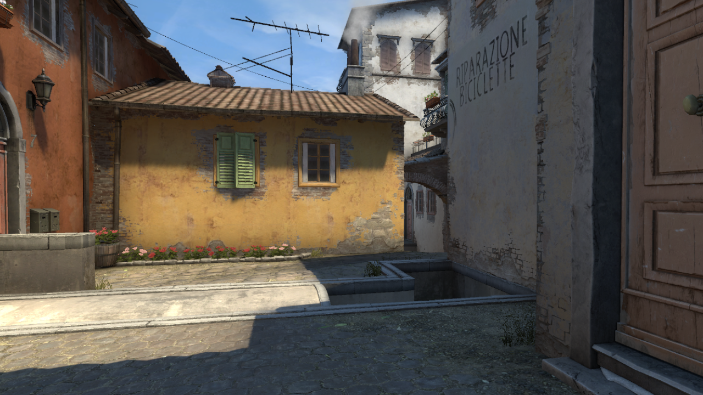
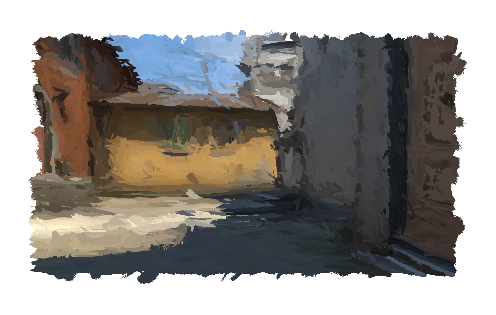

# VirtualBrush
Create virtual brush stroke with bristle simulation and convert an image to a
painting in a *simulation way*, adding brushstrokes until we get a satisfying
result.

The idea is to simulate each individual bristle and to compose a paintbrush with
bristles.
We can then simulate brush strokes with various paintbrushes.

The interesting part of this project is **the journey**, not the result.

## Project Status
The project is currently a work in progress.
There are many bugs to fix, important improvements to bring to the painter
However, the project is already functional.

*Debug*
* Error with the initial direction of the paintbrush, need to clarify

*Improvements*
* Rotation of the paintbrush (interesting for non disk shapes)
* Add more random to the bristle paint
* Make the painter more easy to use and interactive
* Improve performance

## Results

**inferno**

| original | paint |
|---|---|
|  |  |

## The Journey

Searching for references on the internet to convert an image to a painting,
the majority of methods I found used deep learning, transformers, etc.
I thought it was a bit overkill for the task in question, and I thought that
I would surely be able to do it iteratively by filling in a virtual paint.

My original idea was to be as close to a simulation of human interactions
as possible.
By learning about these methods, I noticed that only a limited number of
brushes were used, and transformed.
I thought it would be more interesting to simulate unique brushes.

While searching on this side, I discovered the impressive works of David Li:
[dli/paint](https://github.com/dli/paint).
There is no way I'm doing something so good, but it was from him that I
got the idea of simulating a brush from these bristles.

## Technical Explanations
### Paintbrush

A **Paintbrush** is composed of individual **Bristles**.
Each **Bristle** is represented using Bézier curve.

:construction: TODO / WIP :construction:

### Painting

:construction: TODO / WIP :construction:

### Benchmark
**compute 1 000 000 bezier curve**

| method | time (s) |
| ------ | -------- |
| bezier.bezier_fast | 13.91 |
| bezier.bezier | 30.34 |
| skimage.draw.bezier_curve | 93.22 |

