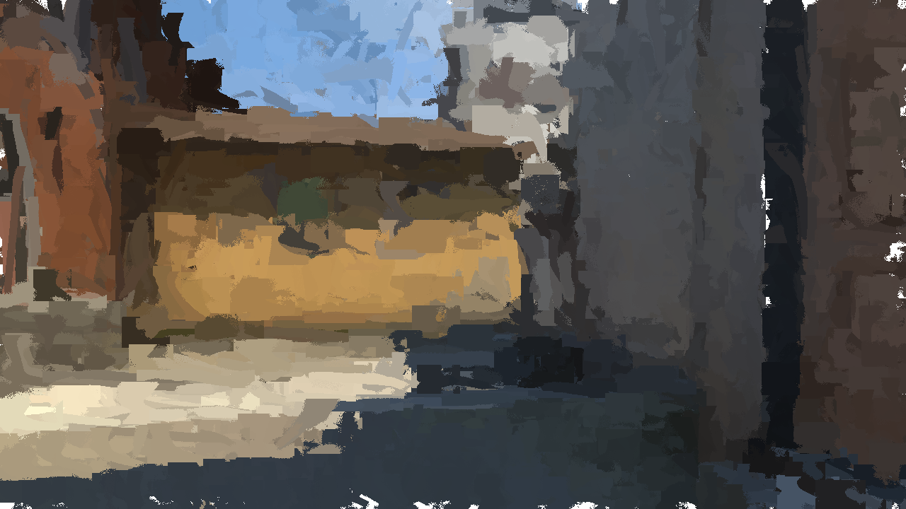
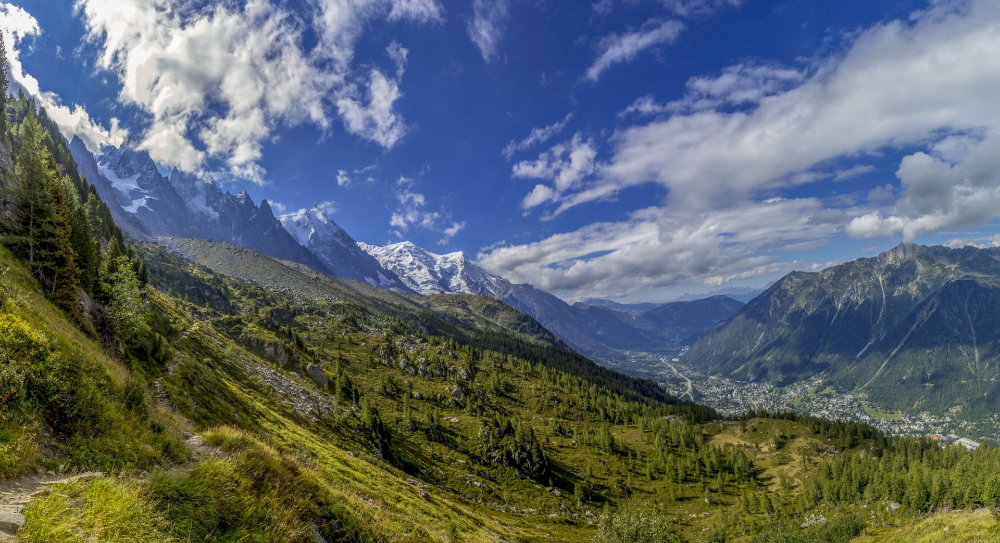
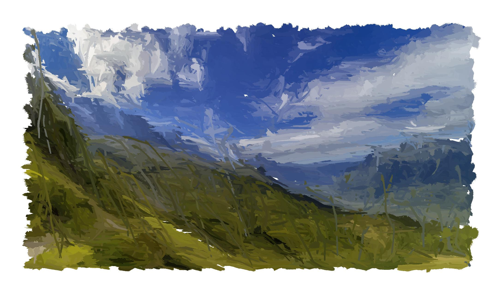

# VirtualBrush
Create virtual brush stroke with bristle simulation and convert an image to a
painting in a *simulation way*, adding brushstrokes until we get a satisfying
result.

The idea is to simulate each individual bristle and to compose a paintbrush with
bristles.
We can then simulate brush strokes with various paintbrushes.

The interesting part of this project is **the journey**, not the result.

## Project Status
The project is currently a work in progress.
There are many bugs to fix, and improvements to make.
However, the project is already functional.

*Debug*
* Error with the initial direction of the paintbrush, need to clarify

*Improvements*
* VirtualBrushPP with C++ brushstrokes
  * Improve performance
* Rotation of the paintbrush (interesting for non disk shapes)
* Add more random to the bristle paint
* Make the painter more easy to use and interactive
* Automatic painter choices

## Results

**inferno**

| original | paint |
|---|---|
|  |  |
|  |  |
|  |  |

## The Journey
### The original idea
Searching for references on the internet to convert an image to a painting,
the majority of methods I found used deep learning, transformers, etc.
I thought it was a bit overkill for the task in question, and I thought that
I would surely be able to do it iteratively by filling in a virtual paint.

My original idea was to be as close to a simulation of human interactions
as possible.
By learning about these methods, I noticed that only a limited number of
brushes were used, and transformed.
I thought it would be more interesting to simulate unique brushes.

While searching on this side, I discovered the impressive works of David Li:
[dli/paint](https://github.com/dli/paint).
There is no way I'm doing something so good, but it was from him that I
got the idea of simulating a brush from these bristles.

### Proof of concept
I started writing **Bristle** and **Paintbrush** classes.
Each classes came with a construction (initialization) and two methods :
*next* and *draw*. The *next* method compute the next position in function of
the movement applied. The *draw* method return the coordinate that have been 
painted.

This part has not taken a lot of time to have results, and the results where
satisfying.
It takes me a little time to find a way to use Bézier curves control points to
make it looks like a real bristle, but it was ok.

### The painter

Now the real results will appear, I started working on a painter system which
will place brushstroke to convert an image into a painting. The idea is to 
segment the image and to replace the segmented area with a brushtroke.
Iterating on this process, I should manage to get a quite good results.

### Performance issues

Will working on the painter, I got the following problem : test a new setup
will take hours, and I cannot afford that.

As you can often hear "Premature optimization is the root of all evil". This is
true, but in my case, I just don't see any other solutions than to improve
the performance of the brushstroke generation.

My idea here was simple, use [numba](https://numba.pydata.org/) just in time
compilation system to improve the speed of the function.

Using PyCharm profiling tool, I was able to detect which part of the code was
the bottleneck.
I started by redefining the Bézier curves and significantly improve their speed.

**compute 1 000 000 bezier curve :**

| method | time (s) |
| ------ | -------- |
| bezier.bezier_fast | 13.91 |
| bezier.bezier | 30.34 |
| skimage.draw.bezier_curve | 93.22 |

I continue to do improvement, using as much numba as possible, but in the end
I has to accept two facts.

* Performance was still an issue, as the improved brushstroke performance
was outweighed by the number of brushstrokes used by the painter.
* The code was getting harder and harder to read has I tried to limit
 the negative impact of python class call and merging functions.
  
Faced with these conclusions, my idea of solution was the following :
I will split the project into two subprojects.
* VirtualBrush, with the python scripts and the painter
* VirtualBrushPP, a C++ implementation of the brushstroke simulation system
with python bindings using [pybind11](https://github.com/pybind/pybind11).
  
### VirtualBrushPP

:construction: I am currently working on this :construction:

## Technical Explanations
### Paintbrush

A **Paintbrush** is composed of individual **Bristles**.
Each **Bristle** is represented using Bézier curve.

:construction: TODO / WIP :construction:

### Brushstroke

A **Brushstroke** is a movement of a **Paintbrush** on a surface,
applying paint.

:construction: TODO / WIP :construction:

### Painter

A **Painter** is a specific algorithm which apply **Brushstroke** on a virtual
paint, using an image as input.

The **Painter** rules will define the style of the painting.

:construction: TODO / WIP :construction:
